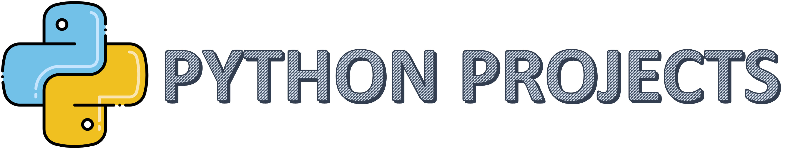

---

<h4 align="center">Consists of projects that are built fully or, primarily with <a href="https://en.wikipedia.org/wiki/Python_(programming_language)" target="_blank">Python</a></h4>

  <a href="#basic-overview">Basic Overview</a> •
  <a href="#prerequisites">Prerequisites</a> •
  <a href="#download">Download</a> •
  <a href="#installation">Installation</a> •
  <a href="#settings">Settings</a> •
  <a href="#support">Support</a> •
  <a href="#license">License</a>

## Basic Overview

contains folder structure and key notes on the repository

## Prerequisites

installation and skills required to follow along with the projects

## Download

Downloading anaconda distribution, visual studio code and kite

## Installation

Installation of the downloaded softwares

## Settings

setting up virtual environments.
utilizing requirements.txt files
other settings and bug fixes (stackoverflow and other links)

## Support

connection and social links for any issue resolution and donations link.

## License

This license allows reusers to distribute, remix, adapt, and build upon the material in any medium or format for noncommercial purposes only, and only so long as attribution is given to the creator. If you remix, adapt, or build upon the material, you must license the modified material under identical terms.
